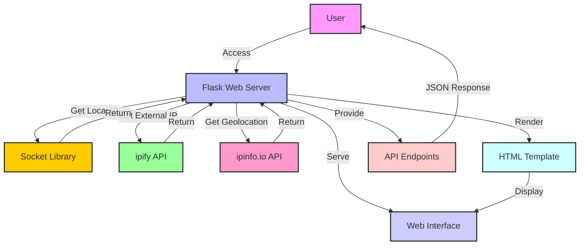

# 🌐 [Get IP](https://github.com/ronknight/get-ip)

#### 🖥️ A Flask web application that displays both local and external IP addresses along with geolocation information.

<p align="center">
<a href="https://twitter.com/PinoyITSolution"></a>
<a href="https://github.com/ronknight?tab=followers"></a>
<a href="https://github.com/ronknight/ronknight/stargazers"></a>
<a href="https://github.com/ronknight/ronknight/network/members"></a>
<a href="https://youtube.com/@PinoyITSolution"></a>
<a href="https://github.com/ronknight/get-ip/issues"></a>
<a href="https://github.com/ronknight/get-ip/blob/master/LICENSE"></a>
<a href="#"></a>
<a href="https://github.com/ronknight"></a>
</p>

<p align="center">
  <a href="#features">Features</a> •
  <a href="#requirements">Requirements</a> •
  <a href="#installation">Installation</a> •
  <a href="#project-structure">Project Structure</a> •
  <a href="#usage">Usage</a> •
  <a href="#api-endpoints">API Endpoints</a> •
  <a href="#example">Example</a> •
  <a href="#web-interface">Web Interface</a> •
  <a href="#application-diagram">Application Diagram</a> •
  <a href="#contributing">Contributing</a> •
  <a href="#license">License</a>
</p>

---

## 🌟 Features

- Retrieves and displays the user's local IP address using the `socket` library
- Fetches the user's external (public) IP address using the [ipify API](https://www.ipify.org/)
- Provides detailed geolocation information based on the external IP using the [ipinfo.io API](https://ipinfo.io/)
- Offers a simple and intuitive web interface for easy viewing of IP and location data
- Includes API endpoints for programmatic access to IP and location information
- Implements error handling for API requests and data retrieval
- Easily integrable into larger projects or extendable for additional functionality

## 📋 Requirements

- Python 3.6+
- Flask 2.0+
- Requests 2.25+

## 🛠️ Installation

1. Clone the repository:
   ```
   git clone https://github.com/ronknight/get-ip.git
   cd get-ip
   ```

2. (Optional) Create and activate a virtual environment:
   ```
   python -m venv venv
   source venv/bin/activate  # On Windows, use `venv\Scripts\activate`
   ```

3. Install the required dependencies:
   ```
   pip install -r requirements.txt
   ```

## 📁 Project Structure

The project has the following structure:

```
get-ip/
│
├── get_ip.py
├── requirements.txt
├── README.md
├── LICENSE
└── templates/
    └── index.html
```

- `get_ip.py`: The main Python script containing the Flask application
- `requirements.txt`: List of Python dependencies
- `README.md`: This file, containing project information and instructions
- `LICENSE`: The license file for the project
- `templates/`: Directory for HTML templates
  - `index.html`: The HTML template for the web interface

## 🚀 Usage

1. Ensure you're in the project directory and your virtual environment is activated (if you're using one).

2. Run the Flask application:
   ```
   python get_ip.py
   ```

3. The server will start running and will be accessible on your local network.

4. Open your web browser and navigate to `http://[your_local_ip]:5000/` to use the web interface.

   Note: Replace `[your_local_ip]` with the IP address displayed in the console when you start the application.

## 📡 API Endpoints

### GET /api/ip

Returns both the local and external IP addresses.

**Response:**
```json
{
    "local_ip": "192.168.1.100",
    "external_ip": "203.0.113.1"
}
```

### GET /api/location

Returns the geolocation information based on the external IP address.

**Response:**
```json
{
    "ip": "203.0.113.1",
    "city": "New York",
    "region": "New York",
    "country": "US",
    "loc": "40.7128,-74.0060",
    "org": "AS12345 Example ISP",
    "postal": "10001",
    "timezone": "America/New_York"
}
```

## 💡 Example

Using curl to test the API (replace `[your_local_ip]` with your actual local IP address):

```bash
curl http://[your_local_ip]:5000/api/ip
```

Expected output:
```json
{
    "local_ip": "192.168.1.100",
    "external_ip": "203.0.113.1"
}
```

```bash
curl http://[your_local_ip]:5000/api/location
```

Expected output:
```json
{
    "ip": "203.0.113.1",
    "city": "New York",
    "region": "New York",
    "country": "US",
    "loc": "40.7128,-74.0060",
    "org": "AS12345 Example ISP",
    "postal": "10001",
    "timezone": "America/New_York"
}
```

## 🌐 Web Interface

The application includes a user-friendly web interface for easy access to IP and location information:

1. Open your web browser and go to `http://[your_local_ip]:5000/`
2. You'll see a page displaying:
   - Your local IP address
   - Your external IP address
   - Detailed geolocation information including city, region, country, and more
3. The information is automatically updated each time you refresh the page

The web interface provides a visually appealing and easy-to-read format for viewing your IP addresses and associated geolocation data.

## 📊 Application Diagram

Here's a visual representation of the Get IP application's structure and data flow:



This diagram illustrates how the different components of the Get IP application interact, from user access to data retrieval and display.
## 🤝 Contributing
Contributions are welcome! Here's how you can contribute to the project:

Fork the repository
Create a new branch (git checkout -b feature/AmazingFeature)
Make your changes
Commit your changes (git commit -m 'Add some AmazingFeature')
Push to the branch (git push origin feature/AmazingFeature)
Open a Pull Request

Please make sure to update tests as appropriate and adhere to the existing coding style.

## 📄 License
This project is licensed under the MIT License - see the LICENSE file for details.

Made with ❤️ by Ronknight